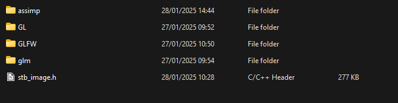
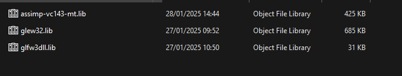

# TEngine

TEngine is a game engine based on a component-based architecture similar to Unity. The goal of the project is to create a full-fledged game engine with the tools necessary for development, so that people can use it to create their own games, and for educational purposes.

# Goals

At the moment, the task is to implement the basic functions of the engine without thinking about optimization and memory management. This engine uses OpenGL systems as renderers, a GLM math library, and a stb_image texture library.

# Setting up the enviroment

1. First we need to install our repository, do it with git clone or just download the archive.
2. Second we need install all library dependencies: glm (latest version on 2025),
glfw: (build from original website 2025), glew (build from original website 2025), stb_image.h (from github repository 2025)
3. Than copy all header files in include directory inside project, should be like this:

4. Copy your libs in lib folder, should be like this:

5. Run the project

# Links

If you have questions or want to work together, please write me

- [GameDev](https://gamedev.net/sekt4nt/)
- [Instagram](https://www.instagram.com/dtoronchenko_/)
- [Reddit](https://www.reddit.com/user/F1oating/)
- [LinkedIn](https://www.linkedin.com/in/dmytro-toronchenko-190383293/)
- [GitHub](https://github.com/f1oating)